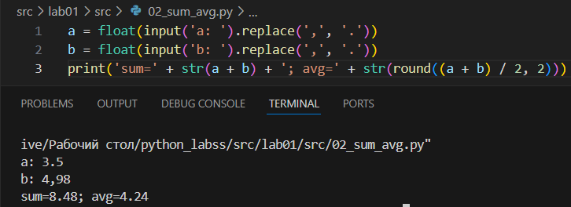
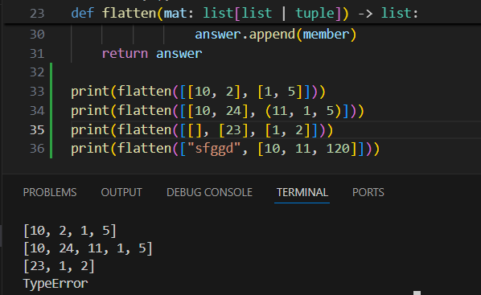

# Лабораторная работа 1 — Ввод/вывод и форматирование

### Задание 1
```python
name = input('Имя: ')
age = int(input('Возраст: '))
print('Привет, ' + name + '! Через год тебе будет ' + str(age + 1) + '.')
```


### Задание 2
```python
a = float(input('a: ').replace(',', '.'))
b = float(input('b: ').replace(',', '.'))
print('sum=' + str(a + b) + '; avg=' + str(round((a + b) / 2, 2)))
```


### Задание 3
```python
price = float(input('Цена: '))
discount = float(input('Скидка: '))
vat = float(input('НДС: '))

base = price * (1 - discount/100)
vat_amount = base * (vat/100)
total = base + vat_amount

print(f'База после скидки: {base:.2f} ₽')
print(f'НДС:               {vat_amount:.2f} ₽')
print(f'Итого к оплате:    {total:.2f} ₽')
```


### Задание 4
```python
m = int(input('Минуты: '))
print(f'{(m // 60) % 24:02d}:{m % 60:02d}')
```


### Задание 5
```python
fio = input('ФИО: ').split()
print(f'Инициалы: {fio[0][0]}{fio[1][0]}{fio[2][0]}')
print(f'Длина (символов): {len(fio[0]) + len(fio[1]) + len(fio[2]) + 2}')
```


# Лабораторная работа 2 — Коллекции и матрицы (list/tuple/set/dict)

### Задание 1.1
```python
def min_max(nums: list[float | int]) -> tuple[float | int, float | int]:
    if len(nums) == 0:
        return ('ValueError')
    else:
        return ((min(nums), max(nums)))
```


### Задание 1.2
```python
def unique_sorted(nums: list[float | int]) -> list[float | int]:
    nums.sort()
    return [*set(nums)]
```


### Задание 1.3
```python
def flatten(mat: list[list | tuple]) -> list:
    answer = []
    for arr in mat:
        if type(arr) == str:
            return ('TypeError')
        else:
            for member in arr:
                answer.append(member)
    return answer
```


### Задание B.1
```python
def transpose(mat: list[list[float | int]]) -> list[list]:    
    if any(len(mat[0]) != len(mat[i]) for i in range(len(mat))):
        return 'ValueError'
    
    elif len(mat) == 0:
        return []
            
    new_matrix = [[0 for i in range(len(mat))] for x in range(len(mat[0]))]
    for x in range(len(mat)):
        for y in range(len(mat[x])):
            new_matrix[y][x] = mat[x][y]
    return new_matrix
```


### Задание B.2 
```python
def row_sums(mat: list[list[float | int]]) -> list[float]:
    if any(len(mat[0]) != len(mat[i]) for i in range(len(mat))):
        return 'ValueError'
    
    elif len(mat) == 0:
        return []
    
    summa = []
    for arr in range(len(mat)):
        summa.append(sum(mat[arr]))
    return summa
```


### Задание B.3
```python
def col_sums(mat: list[list[float | int]]) -> list[float]:
    if any(len(mat[0]) != len(mat[i]) for i in range(len(mat))):
        return 'ValueError'
    
    elif len(mat) == 0:
        return []
    
    summa = [0 for i in range(len(mat[0]))]
    for x in range(len(mat)):
        for y in range(len(mat[x])):
            summa[y] += (mat[x][y])
    return summa
```


### Задание C
```python
def format_record(rec: tuple[str, str, float]) -> str:
    name_data = rec[0].strip().split()
    if len(name_data) > 2:
        surname, name, patronymic = rec[0].strip().split()
        name_string = f"{surname[0].upper()}{surname[1:]} {name[0].upper()}.{patronymic[0].upper()}."
    elif len(name_data) == 2:
        surname, name = rec[0].strip().split()
        name_string = f"{surname[0].upper()}{surname[1:]} {name[0].upper()}."
    elif len(name_data) == 1:
        surname = rec[0].strip().split()
        name_string = f"{surname[0].upper()}{surname[1:]}"
    else:
        return ValueError
    
    group = rec[1].strip()
    if group == '': 
        return ValueError

    if type(rec[2]) != float and type(rec[2]) != int:
        return 'TypeError'
    else:
        gpa = float(rec[2])

    return f'{name_string}, гр. {group}, GPA {gpa:.2f}'
```


# Лабораторная работа 3 — Тексты и частоты слов (словарь/множество)

### Задание A
#### normalize
```python
from re import finditer

def normalize(text: str, *, casefold: bool = True, yo2e: bool = True) -> str:
    if casefold: 
        text = text.casefold()          # нижний регистр

    if yo2e:
        text = text.replace('ё', 'е').replace('Ё', 'Е')         # меняем "ё" на "е"

    text = text.replace('\t', ' ').replace('\r', ' ').replace('\n', ' ')

    while '  ' in text:
        text = text.replace('  ', ' ')          # схлопывыаем пробелы

    return text.strip()
```
#### tokenize
```python
def tokenize(text: str) -> list[str]:
    tokens = finditer(pattern = r'\w+(?:-\w+)*', string = text)         # ищем слова с дефисами

    return [i.group() for i in tokens]
```
#### count_freq
```python
def count_freq(tokens: list[str]) -> dict[str, int]:
    count = {}          # создаем пустой словарь для подсчетов
    for i in tokens:
        if i in count:
            count[i] += 1
        else:
            count[i] = 1            # если есть, то счетчик увеличивается на 1, иначе добавляем значение с единицей
    return count
```
#### top_n
```python
def top_n(freq: dict[str, int], n: int = 5) -> list[tuple[str, int]]:
    freq = sorted(freq.items(), key=lambda item: [-item[1], item[0]])       # список кортежей (ключ, значение) сортируем частоту по убыванию, а слова по возрастанию
    result = []
    for i in range(min(n, len(freq))):
        result.append((freq[i][0], freq[i][1]))

    return result
```
### Проверим все выше описанные функции


### Задание B
```python
import sys   # импортируем систему, чтобы применить ввод stdin и добавить путь к папке
sys.path.append(r'C:\Users\kira_\OneDrive\Рабочий стол\python_labss\src')  # добавляем путь к папке
from lib.text import normalize, tokenize, count_freq, top_n

def main():
    stroke = sys.stdin.read()   # читаем весь ввод до конца файла. Чтобы его прервать -> Ctr+Z+Enter
    norm_stroke = tokenize(normalize(stroke))   # приводим все к одному регистру
    uniq_stroke = len(set(norm_stroke))   # возвращаем список уникальных элементов
    freq = count_freq(norm_stroke)
    top_5 = top_n(freq, 5)

    print('Всего слов:', len(norm_stroke))
    print('Уникальных слов:', uniq_stroke)
    print('Топ-5:')
    for i in top_5:
        print(f'{i[0]}:{i[1]}') 

while True:  # для бесконечного вызова функции
    main()   # вызов функции
```


# Лабораторная работа 4 — Файлы: TXT/CSV и отчёты по текстовой статистике

### Задание A
```python
from pathlib import Path
import csv
from typing import Iterable, Sequence
from collections import Counter

def ensure_parent_dir(path: Path | str) -> None:
    p = Path(path)
    parent_dir = p.parent       # создаем родительскую директорию, если ее еще нет
    parent_dir.mkdir(parents=True, exist_ok=True)


def read_text(path: str | Path, encoding: str = "utf-8") -> str:
    p = Path(path)   # создаем путь к файлу - Path-объект
    
    if not p.exists():   # проверка существования файла
        raise FileNotFoundError('Файл не найден')
    return p.read_text(encoding=encoding)


def write_csv(rows: Iterable[Sequence], path: str | Path, header: tuple[str, ...] | None = None) -> None:

    p = Path(path)   # Создаем путь
    rows = list(rows)

    with p.open('w', newline='', encoding = 'utf-8') as f:
        w = csv.writer(f)           # создаем объект writer для записи в csv формат
        if header is not None:
            w.writerow(header)          # записываем заголовок, если такой существует
        
        if rows:            # проверка на не равную длину строк
            for r in rows:
                if len(r) != len(rows[0]):
                    raise ValueError("Строки имеют разную длину!")

        for r in rows:
            w.writerow(r)           # запись рядов построчно

# функция не возвращает ничего, она записывает данные в CSV файл
```
#### Пример 1:


#### Пример 2


#### Пример 3


### Задание B
``` python
import sys   
sys.path.append('C:\Users\kira_\OneDrive\Рабочий стол\python_labss\src')
from lib.text import normalize, tokenize, count_freq, top_n
from lib.io_txt_csv import read_text, write_csv, write_text


txt = read_text('data/lab04/input.txt')
txt = tokenize(normalize(txt))
txt_counts = top_n(count_freq(txt))
print('Всего слов:', len(txt))
print('Уникальных слов:', len(set(txt)))
print('Топ-5:')
for i in txt_counts:  
    print( f'{i[0]}:{i[1]}') 

write_csv(txt_counts, 'data/lab04/report.csv', ("word", "count"))
```
#### Пример 1

#### Пример 2

#### Пример 3
